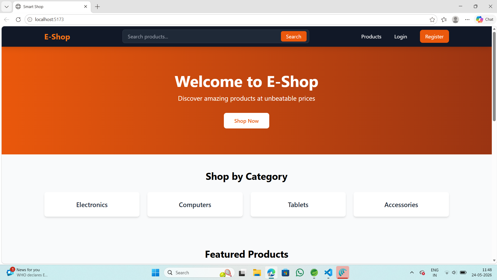
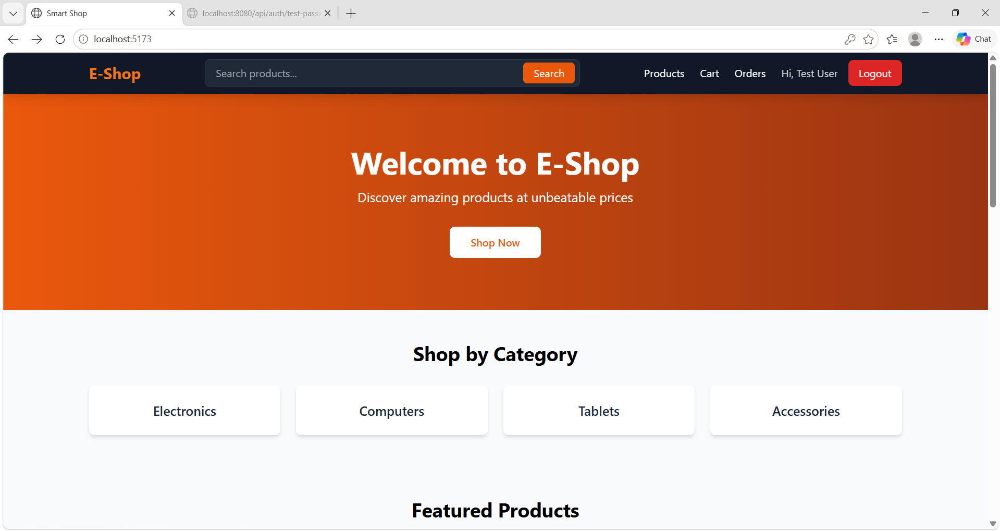
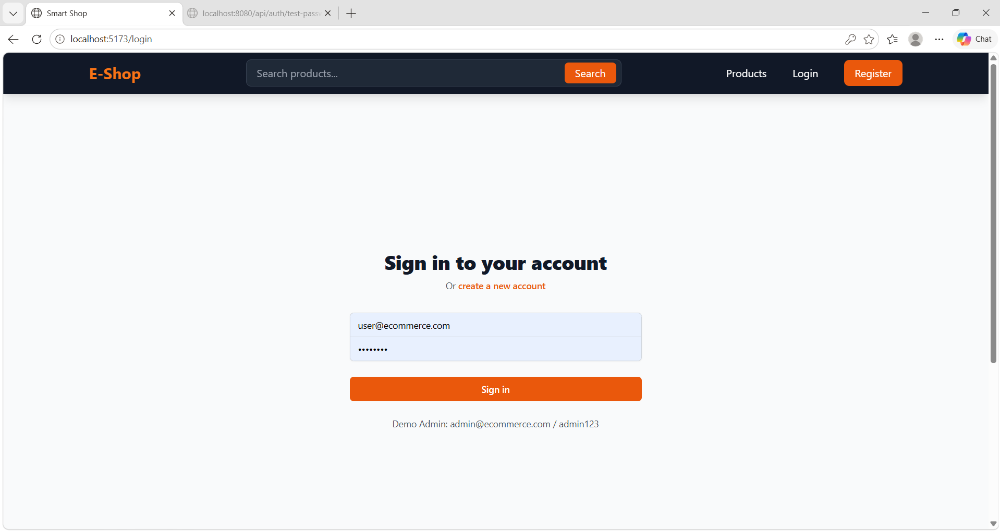
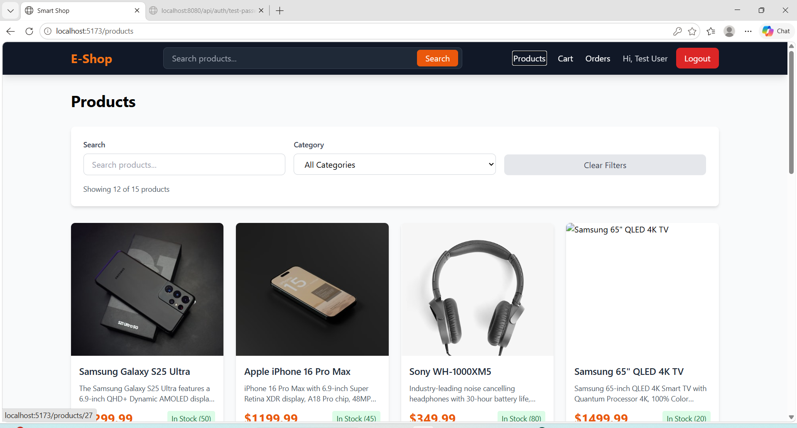
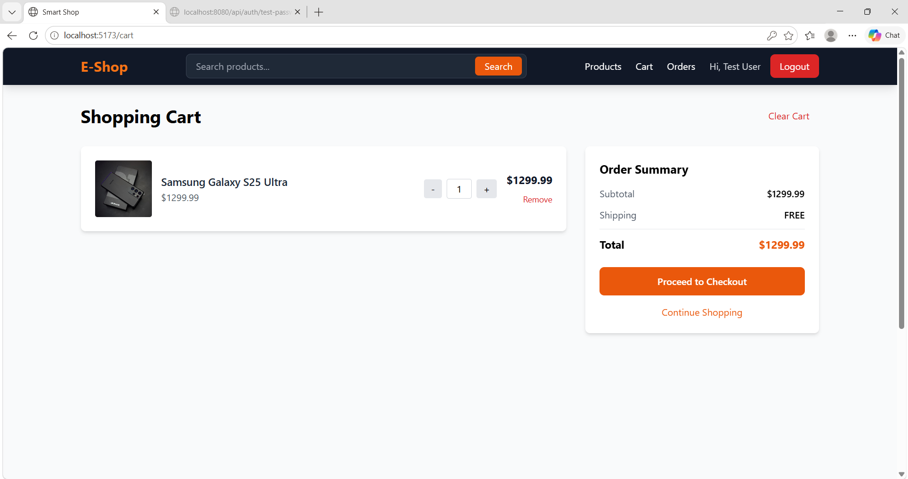
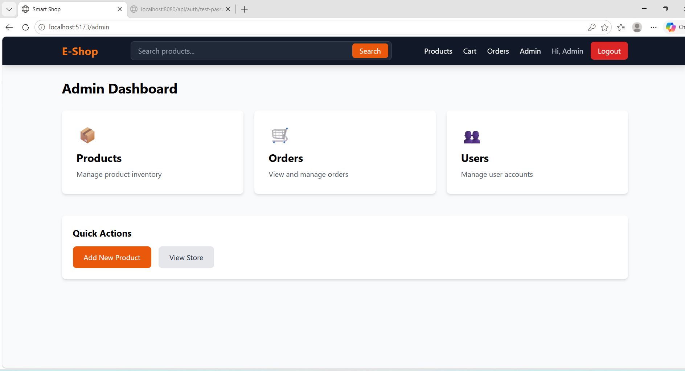
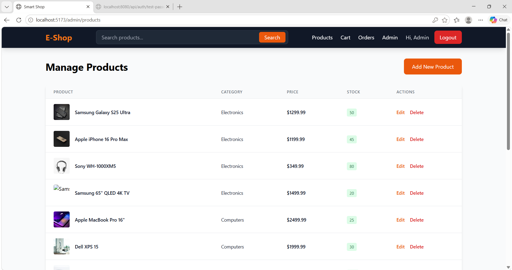

# 🛒 E-Shop — Full Stack E-Commerce Application

> A production-ready e-commerce platform built with **React 18** and **Spring Boot 3**, featuring secure JWT authentication, role-based access control, and a complete admin dashboard.

---

## 📸 Project Screenshots

### 🏠 Home Page


---

### 👤 User Homepage


---

### 👤 User Homepage View 1


---

### 👤 User Homepage View 2


---

### 🔐 Login Page


---

### 🛒 Products Page


---

### 🛍️ Cart Page


---

### ➕ Add Product


---

### ⚙️ Admin Dashboard


---

### 👥 Manage Users


---

### 📦 Manage Products

## 💡 What I Built

A fully functional e-commerce web application from scratch — covering everything from user authentication to order management — with both customer-facing and admin-facing interfaces.

### Customer Experience
- 🔐 Secure login & registration with JWT
- 🛍️ Browse, search & filter products by category
- 🛒 Real-time cart management
- 📦 Order placement & history tracking
- 📱 Fully responsive on all devices

### Admin Panel
- 📊 Dashboard with business overview
- ➕ Full product CRUD (Create, Read, Update, Delete)
- 📋 Order status management
- 👥 User account management

---

## 🛠️ Tech Stack

### Frontend
| Technology | Purpose |
|------------|---------|
| React 18 | UI framework |
| Vite | Fast build tool |
| React Router DOM v6 | Client-side routing |
| Tailwind CSS | Utility-first styling |
| Axios | HTTP client for API calls |
| React Toastify | Toast notifications |
| Context API | Global auth state management |

### Backend
| Technology | Purpose |
|------------|---------|
| Java 21 | Core programming language |
| Spring Boot 3.2.3 | Backend application framework |
| Spring Security | Authentication & authorization |
| JWT | Stateless token-based security |
| Spring Data JPA | Database abstraction layer |
| Hibernate | ORM for database mapping |
| MySQL 8 | Relational database |
| Maven | Dependency & build management |
| Swagger / OpenAPI | Interactive API documentation |

---

## 📁 Project Structure

ecommerce-app/
│
├── backend/
│   └── src/main/java/com/ecommerce/
│       ├── config/           # Security & CORS configuration
│       ├── controller/       # REST API endpoints
│       ├── service/          # Business logic layer
│       ├── repository/       # Data access layer
│       ├── entity/           # JPA database entities
│       ├── dto/              # Request & response objects
│       ├── exception/        # Global exception handling
│       └── security/jwt/     # JWT filter & token utilities
│
└── frontend/
└── src/
├── components/       # Reusable UI components
│   ├── Navbar
│   ├── Footer
│   ├── ProductCard
│   ├── Pagination
│   ├── LoadingSpinner
│   └── ProtectedRoute
├── pages/            # Route-level page components
│   ├── Home
│   ├── Products
│   ├── ProductDetails
│   ├── Cart
│   ├── Checkout
│   ├── Orders
│   ├── Login
│   ├── Register
│   └── admin/
│       ├── AdminDashboard
│       ├── AdminProducts
│       ├── ProductForm
│       ├── AdminOrders
│       └── AdminUsers
├── context/
│   └── AuthContext    # Auth state & JWT management
└── services/          # Axios API service layer
├── api
├── authService
├── productService
├── cartService
├── orderService
└── userService

---

## ⚙️ Getting Started

### Prerequisites
- Java 21
- Node.js 16+
- MySQL 8+
- Maven

### 1. Clone the repo
```bash
git clone https://github.com/pradeeprdy1973/ecommerce-app.git
cd ecommerce-app
```

### 2. Configure Database
Open MySQL and run:
```sql
CREATE DATABASE ecommerce_db;
```

Update `backend/src/main/resources/application.properties`:
```properties
spring.datasource.url=jdbc:mysql://localhost:3306/ecommerce_db?createDatabaseIfNotExist=true&useSSL=false&serverTimezone=UTC&allowPublicKeyRetrieval=true
spring.datasource.username=root
spring.datasource.password=your_password
jwt.secret=your_256bit_secret_key
jwt.expiration=86400000
```

### 3. Run Backend
```bash
cd backend
mvn spring-boot:run
```
Runs at `http://localhost:8080`

### 4. Run Frontend
```bash
cd frontend
npm install
npm run dev
```
Runs at `http://localhost:5173`

---

## 🔑 Test Credentials

| Role | Email | Password |
|------|-------|----------|
| 👑 Admin | admin@ecommerce.com | ****** |
| 👤 User | user@ecommerce.com | admin123 |

---

## 📡 API Endpoints

### Authentication
| Method | Endpoint | Description | Access |
|--------|----------|-------------|--------|
| POST | /api/auth/register | Register new user | Public |
| POST | /api/auth/login | Login and receive JWT | Public |
| POST | /api/auth/logout | Logout user | Public |

### Products
| Method | Endpoint | Description | Access |
|--------|----------|-------------|--------|
| GET | /api/products | Get all products | Public |
| GET | /api/products/{id} | Get product by ID | Public |
| GET | /api/products/search | Search and filter | Public |
| POST | /api/admin/products | Create product | Admin |
| PUT | /api/admin/products/{id} | Update product | Admin |
| DELETE | /api/admin/products/{id} | Delete product | Admin |

### Cart
| Method | Endpoint | Description | Access |
|--------|----------|-------------|--------|
| GET | /api/cart | View cart | User |
| POST | /api/cart/add | Add item to cart | User |
| PUT | /api/cart/update | Update quantity | User |
| DELETE | /api/cart/items/{id} | Remove item | User |

### Orders
| Method | Endpoint | Description | Access |
|--------|----------|-------------|--------|
| POST | /api/orders | Place new order | User |
| GET | /api/orders | View order history | User |
| GET | /api/admin/orders | All orders | Admin |
| PUT | /api/admin/orders/{id} | Update order status | Admin |

### Users
| Method | Endpoint | Description | Access |
|--------|----------|-------------|--------|
| GET | /api/admin/users | All users | Admin |

---

## 🎯 Key Technical Highlights

- ✅ **JWT Security** — Stateless authentication with role-based route protection on both frontend and backend
- ✅ **Clean Architecture** — Strict separation of Controller → Service → Repository layers
- ✅ **DTO Pattern** — Clean separation between API contracts and database entities
- ✅ **Global Exception Handling** — Consistent, structured error responses across all endpoints
- ✅ **Protected Routes** — Frontend and backend both enforce role-based access control
- ✅ **Responsive UI** — Fully functional on mobile and desktop screens
- ✅ **Pagination & Search** — Efficient data loading with server-side pagination and filtering

---

## 🔮 Future Enhancements

- [ ] Payment gateway integration (Razorpay / Stripe)
- [ ] Email notifications for orders
- [ ] Product image upload to cloud storage
- [ ] Product reviews and ratings
- [ ] Wishlist feature
- [ ] Docker containerization

---

## 👨‍💻 Author

**Pradeep**  
Java Full Stack Developer

---
